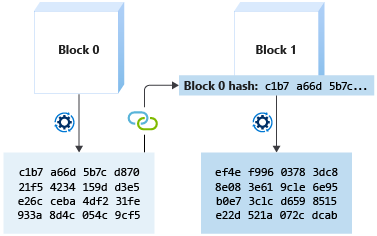
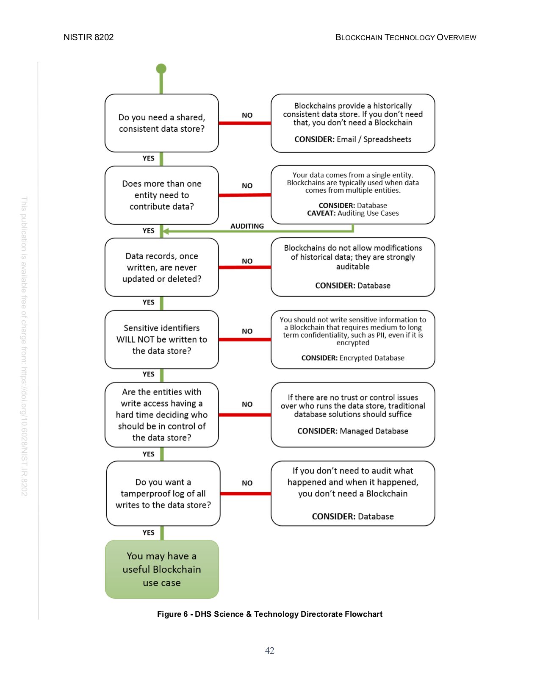

# Blockchain development

## Introduction

A small collection of definitions, links and experiments to study about blockchain development. The objective is to gain enough knowledge to understand basic Web3-related definitions, install and examine commonly used Development tools, deploy a Web3 application and most importantly learn how to read and manage a Web3 application's architecture. 

## Blockchain definition  

> A blockchain is a collaborative, tamper-resistant ledger that maintains transactional records. The transactional records (data) are grouped into blocks. A block is connected to the previous one by including a unique identifier that is based on the previous block’s data. As a result, if the data is changed in one block, it’s unique identifier changes, which can be seen in every subsequent block (providing tamper evidence). This domino effect allows all users within the blockchain to know if a previous block’s data has been tampered with. Since a blockchain network is difficult to alter or destroy, it provides a resilient method of collaborative record keeping.  

The term blockchain is made by two different words:  
 - `block`  
    ```
    A block is a cluster of data within the blockchain that stores transaction information
    ```
 - `chain`
    ```
    Blocks are connected to each other using cryptographic hash to create link between blocks. 
    ```
  

  
## Why would you use it?
To distribute and validate data across all users.  
A good example can be found in [Microsoft Learn - Get started with ethereum blockchain development - Chapter 1 - Introduction](https://docs.microsoft.com/en-us/learn/modules/intro-to-blockchain/1-introduction)  
To better understand the topic, the following image explains when you *should not* use the blockchain.  


## What is a Smart Contract?  

> A smart contract is a program that's stored inside a blockchain. Smart contracts extend blockchain from data to code. They represent an agreement between parties. The agreement is coded, and when an action happens, the code runs and provides a response. Each smart contract is assigned a 20-byte address that uniquely identifies it.

### Links  
  
1. Blockchain  
   1.1. Definition
      - [National Institute of Standards and Technology - Blockchain](https://www.nist.gov/blockchain)  
  
   1.2. Development  
      - [Microsoft Learn - Get started with ethereum blockchain development](https://docs.microsoft.com/en-us/learn/paths/ethereum-blockchain-development/)  
  
2. Smart contracts  
   2.1 Definition 
    - [Microsoft Learn - What is a smart contract?](https://docs.microsoft.com/en-gb/learn/modules/blockchain-solidity-ethereum-smart-contracts/2-smart-contracts)  

   2.2 Development  

   2.2.1 Must-use Frameworks  
   - [Truffle](https://trufflesuite.com/)
   - [OpenZeppelin](https://www.openzeppelin.com/)
